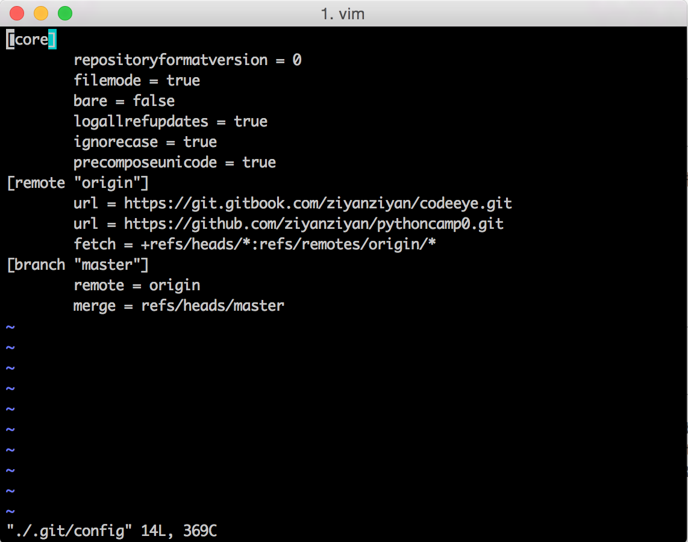

# Gitbook 101

## Gitbook 是什么
---
网络发布的开源电子书，发布平台 www.gitbook.com

## Gitbook 的建立
---
* 注册（或用 Github 等账号登陆）后，在 Gitbook 首页的右上角点击 Create New Book 建立新书。记得 Copy 下来用于 push 的地址，比如本书的 push 地址是：“http://git.gitbook.com/ziyanziyan/codeeye.git”。 

* 在本地用 Markdown 编辑器按照 Markdown 语法编辑。

## 与 Github 连接推送
---
* 如果要用 Github 代码推送，就在建立时用 Github 账户登陆

* 新建的书在 Edit 的 Github Integration 中填入这本书在 Github 中的 repository 地址，并 Add a webhook

* Clone 那个 Github 的 repository 到本地

* 在本地的 Terminal 中进入本地 repository，使用代码 “$ cd repository_name”，使用 “$ git init” 初始文件夹

* 然后使用 “vi ./.git/config” 进入 config，按 “i” 进入 INSERT 模式，在[remote "origin"]的段落加入 url = gitbook 链接，然后按 esc 退出 INSERT 模式，输入 “:wq” 退出 config

* 完整地 config 信息如图：

   
	
* 第一次的推送代码是 “$ git push -u origin master”，之后就不用写 “-u” 了。

* 当提示需要输入用户名和密码时有一个需要注意的地方：输入密码并不在 Terminal 内显示任何变化，就像没输入一样，但实际上它在记录哦，所以认真敲对之后按回车就好了，它会继续验证。

## 遇见并拍死了哪些 Bug
---
* Gitbook 推送失败 while 同时推送的 Github 成功。在 Gitbook 的 History 中看见红色的叹号，提示“Cannot read property 'text' of undefined”。经 Google 了解到是因为 SUMMARY.md 中 list 和 list 之间被我不小心多加了空行。

## 偷偷告诉你的 Tips
---
最快的学习方法是 Fork 一本完成的书，研究模仿各个文件的架构和写法，再写自己的。

